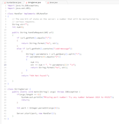
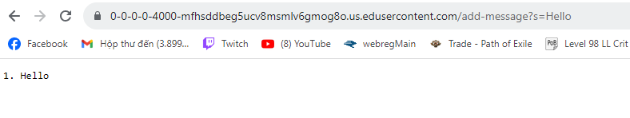
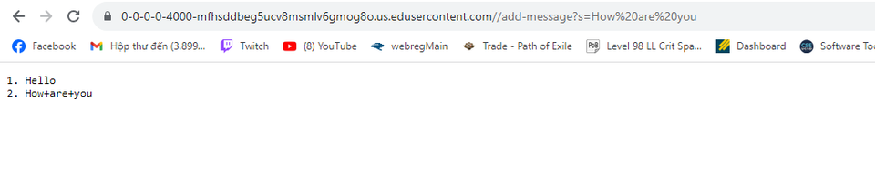

# Lab Report 2

**Part 1**

* Method handleRequest(), getPath(), getQuery() are being called in this case.
* The relevant argument is the URI object named url, representing the upcoming URL. There are 2 fields in the Handler class: String str and int num.
* The getPath() and getQuery() do not take any arguments. But the split() method takes '=' as an argument.  
* After the request, "num" will be updated to 1, and 'str' will be updated to "1. Hello\n"

* Method handleRequest(), getPath(), getQuery() are being called in this case.
* The relevant argument is the URI object named url, representing the upcoming URL. There are 2 fields in the Handler class: String str and int num.
* The getPath() and getQuery() do not take any arguments. But the split() method takes '=' as an argument.  
* After the request, "num" will be updated to 2, and 'str' will be updated to "1. Hello\n
                                                                               2. How are you\n

**Part 2**

  

**Part 3**

From lab in weeks 2 and 3, I learned how to create a server, I know how to log into a remote server. I also learned more about how to create a simple string server and use the URL to execute   some "actions". The thing I like the most is about the server. I did not know how to create a server before, but now after reading the Server.java and practicing with StringServer, I know more about how to code a server and how to make a server for myself. I also know more about URLs, and what a path, query or anchor is.   
