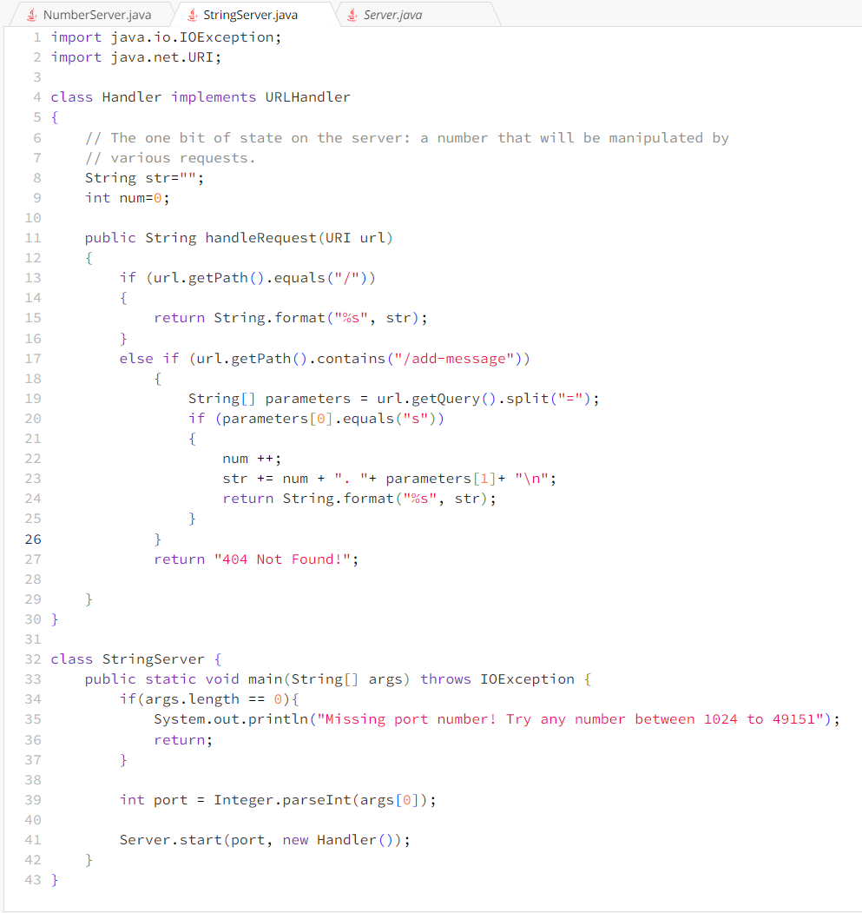

# Lab Report 2

**Part 1**

* Method handleRequest(), getPath(), getQuery() are being called in this case.
* The relevant argument is the URI object named url, representing the upcoming URL. There are 2 fields in the Handler class: String str and int num.
* The getPath() and getQuery() do not take any arguments. But the split() method takes '=' as an argument.  
* After the request, "num" will be updated to 1, and 'str' will be updated to "1. Hello\n"

* Method handleRequest(), getPath(), getQuery() are being called in this case.
* The relevant argument is the URI object named url, representing the upcoming URL. There are 2 fields in the Handler class: String str and int num.
* The getPath() and getQuery() do not take any arguments. But the split() method takes '=' as an argument.  
* After the request, "num" will be updated to 2, and 'str' will be updated to "1. Hello\n
                                                                               2. How are you\n

  **Part 2**

  
  
